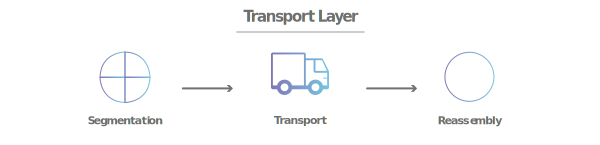
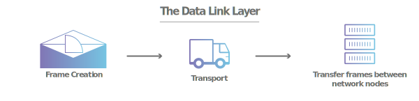

# OSI Model (Open System Interconnection Model)
## Introduction
OSI or Open System Interconnection model describes the process of how data is transferring and receiving between the computer system in the computer network. In the computer network computers are connected with the help of network cable(like LAN cable) and network connectors(like RJ45) and transfers and receives data using NIC Cards(Network Interface Card).
Now to make a successful data communication between two computer systems, both the computer(sender & receiver) must have the same OS installed so that they can understand what is received. But what if both the computers do not have the same OS installed then how they can make a successful data communication. Now in this scenario, the OSI model plays an important role, it describes a stander way of data communication between two different computers.

## What is OSI Model?
OSI  model is a conceptual model created by IOS (Internation Organization For Standardization) in 1984 for making a standard way of communication between two different commuter systems. The OSI model uses seven layers to describe what is happening in the network or say how data is transferred between two different computers.
This layered system also helps the network manager to narrow down the problems in a computer network(Is it a physical issue or something wrong with the application?).
These seven layers visualize how the data flow from sender to receiver in a network. Let's see what are the seven layers of the OSI model.

## 7 layers Of OSI Model

#
Generally, all the seven layers of the OSI model are described from top to bottom. This sequence shows that how data flow from the sender(top layer e.i. Application Layer) to the network(bottom layer e.i. physical layer). The reserver sequence of the model e.i. from layer-1(physical layer) to layer-7(Application layer) show that how data flow from the network to the receiver(e.i. Application layer). See the below diagram.

Here each layer of the model contains a package of protocols which are being used while performing any of the function at a particular layer. See the below diagram.

### 7. Application Layer
The application layer is the closest layer to the end-user in the OSI model. This layer is used by network applications on the client-side. These network applications include Google Chrome, Firefox, Outlook, WhatsApp, and other applications which use the internet or any other network for data communication.
This layer provides a package of protocols which includes HTTP, HTTPS, SMTP, FTP, IRC, etc. Computer programmer follows these protocols while developing any network application. Each application layer protocol has unique functionality like HTTP & HTTPS protocols are used for web surfing, the SMTP protocol is used for email communication and FTP is used to transfer the file between two computers.

### 6. Presentation Layer
The presentation layer performs translation of data in the OSI model. When a sender sends some data, it received(or say it receives data from the transport layer) in the form of binary bits. This layer converts the data in a presentable format for the application layer so that the end-user(receiver) can consume it.
In the network data transmitted in the form of bits, so when the sender wants to send some data to the receiver this layer converts the data into binary bits before transmitting it to the receiver.
Presentation layer perform various task like translation, encryption/decryption and compression of data.

### 5. Session Layer
The session layer is the layer where the connection between two computer devices opens and closes. The session layer opens the connection between two computers before transmitting any data and maintains a session(enough time period to transmit the data). The session is also known as the time period between when the communication starts and ends. A session is maintained as long as the data is not transferred or the session termination signal has not occurred. After a successful data transmission session is terminated to avoid wastage of resources.
The session layer also maintains checkpoints. Let's say 10mb of data has to be transferred then the session layer could set a check-point after each successful transmission of 1mb. So if data transmission is interrupted after 6mb of successful transmission, the session layer can resume from the last check-point to complete the data transmission. If there is no check-point policy the sender has to transfer all the data once again.

### 4. Transport layer
The transport layer is responsible for the end-to-end reliable communication through Segmentation, Flow Control & Error Control. The transport layer takes data from the session layer and breaks it up into chunks called Segment and this process is called Segmentation. Each segment has the source and destination port number and sequence number. source port no. shows that which port number is used to send the segment by the send and the destination port shows that on which port number the segment would be received at the receiver side. Sequence no. help the receiver transport layer to re-arrange all the received segments and re-assembles all the segment before giving it to the session layer.
The transport layer performs error control at the receiver end. The transport layer checks for the error in the received segment, if all segments are error-free then it re-assembles the segment and transfers it to the session layer. If any of the segments have an error then it signals the transport layer at the sender side to re-transfer the faulty segment.
Flow control is the task where the transport layer ensures that data transmission should be done smoothly. For example:- if send has the capacity of transferring data @10mbps but the receiver has the capacity of receiving data @1mbps then the transport layer signals the sender to slow down the data transfer according to the receiver's data capturing speed. And say if the receiver has the capacity of capturing data @5mbps but the sender is transferring data at 1mbps then it signals the sender to increase the transfer speed.

### 3. Network Layer
The network layer is responsible for transferring data between two different computer networks. This is the layer where routers and other networking devices are used to form a computer network. The network layer takes data segments from the transport layer and divides them into smaller chunks known as data packets on the sender side.
The network layer adds the IP address of the sender & receiver with each data packet and determines the best possible path to transmit data packets using routing protocols.
On the receiver side network layer receives data from the data link layer and gives it to the transport layer.

### 2. Data Link Layer
The Data Link layer receives data packets from the network layer and adds the physical address of the sender and receiver with each data packet. There are two kinds of addressing one is Logical Addressing which is done at the network layer and the other is Physical Addressing which is done at the data link layer.
Logical addressing is the way of assigning an IP address to the computer and data packets whereas Physical addressing is the way of assigning MAC(Media Access Control) address to the computer. MAC is a 48 bit or 64-bit unique address assigned to the NIC(Network Interface Card) card by the manufacturer.
Data packets at the data link layer are called frames. These data frames are now transfers to the physical layer for the actual transmission of data from one device to another device.

### 1. Physical layer
The physical layer includes the data transfer media devices. The physical layer provides the medium for data transmission. Following are some medium which is used for data transmission:-
1. Wired Medium
    i. Co-axil Cable
    ii. Fiber Optical Cable
    iii. Twisted Pair Cable
2. Wireless Medium
    i. Radio Waves
    ii. Micro Waves
    iii. Infrared
Network devices like Hubs, Repeaters are used. The physical layer converts the data frames into bitstreams and transmits them on the transmission medium.

#
#
## References
https://www.youtube.com/watch?v=vv4y_uOneC0
https://www.cloudflare.com/en-in/learning/ddos/glossary/open-systems-interconnection-model-osi/
https://int0x33.medium.com/day-51-understanding-the-osi-model-f22d5f3df756
